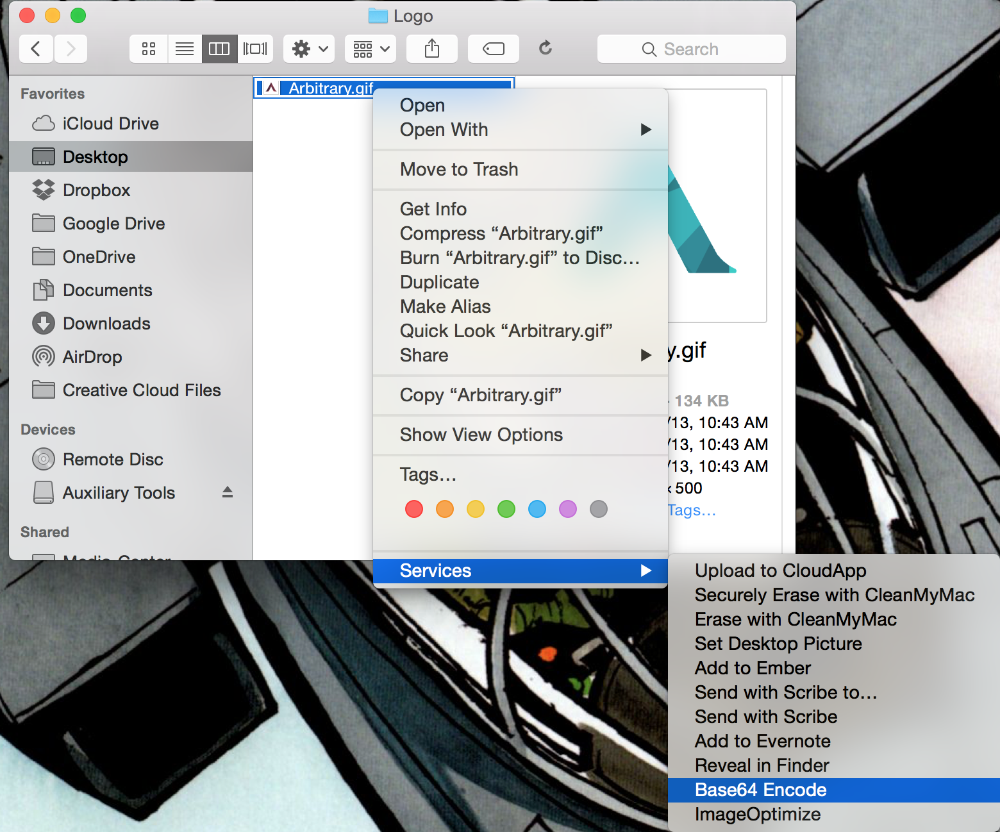

Base64 Encode
=================

Base64 Encode is an OSX Service used to encode files to [Data URIs](http://en.wikipedia.org/wiki/Data_URI_scheme). With this tool encoding an image, SVG or any other file to a Data URI is a right click away. The resulting output will automatically be copied to your clipboard for use in your web page or stylesheet.

Installing
------------------
1. Add the Base64 Encode.service file to **/Library/Services** on your computer.
2. Right click on any file from Finder. Click "Base64 Encode" to encode that file.

Building from Source
------------------
Base64 Encode has no external dependancies. Simply open the Base64 Encode.xcodeproject and Build. Let us know if there are any issues.

Version History
------------------
#### 1.0
- Initial release.
- Future features to think about
    + Adding an app icon. Is that needed for a service?
    + Erroring out if a file is too large, or if an invalid file is chosen (such as a directory)
    + Creating an installer (PKG perhaps?)
    + Insuring it loads on bootup

Contact
------------------
Built lovingly by the good folks at [Arbitrary](http://arbitrary.io). Follow us on [Twitter](http://twitter.com/arbitraryco).

License
------------------
Base64 Encode is released under the MIT license. See LICENSE for details.